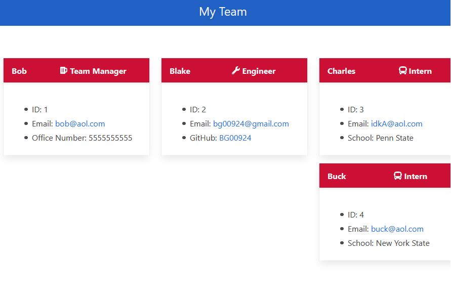

# My-Team

## Table of Contents

## Description

* This project allows for users to rapidly generate a one stop shop for basic information on team members.

## Installation:
  
* Users only need to clone the repository to their local machine and ensure inquirer is installed in the app main directory.
  
## Usage:
  
* The primary use for this project is to generate an HTML document to display basic information on team members.

* Please, see the following for a walkthrough video: https://drive.google.com/file/d/1Nr9zI3tBzeHorvadcQXdxDZrFnpRdfW6/view?usp=sharing.

## Credits:

* Blake Gale
* node
* inquirer

## Tests:

* There are four test suites built into the code for the program and can be ran from the terminal.

## Questions:
  
For additional information visit my GitHub page:
* [GitHub Profile](https://github.com/bg00924)

For questions please send me an email at:
* bg00924@gmail.com

## Preview

